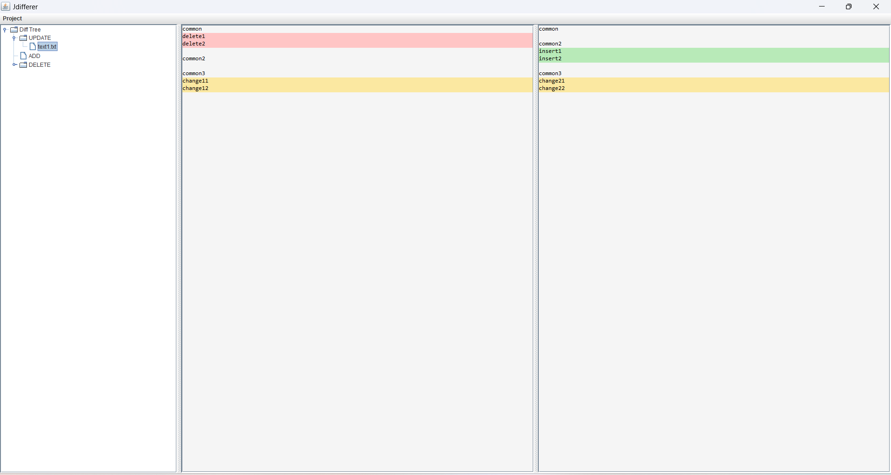

# Jdifferer

[English](readme.md) | [中文](readme-zh.md)

Jdifferer是一个用来比较两个java jar文件的GUI应用，方便开发者和安全研究人员快速找到两个jar文件的不同。

Jdifferer会自动对两个jar文件反编译，然后用友好的GUI界面显示源码层面上的不同。

反编译的API由[jd-core](https://github.com/java-decompiler/jd-core)提供。

## Usage

点击左上角的Project -> open来选择需要比较的两个jar文件

在左边的侧边栏中提供三个子结点，分别代表两个jar文件的改动过的文件、增添的文件和删除的文件

在update节点的窗口中，红色表示删除的内容，绿色表示增添的内容，黄色表示删除的内容。（下图仅供说明）

## TODO

- [x] filetree
- [x] main gui
- [x] dialog for choosing directory
- [x] code highlight
- [x] diff
- [x] line wrap
- [ ] auto expand
- [x] error dialog
- [ ] ctrl f