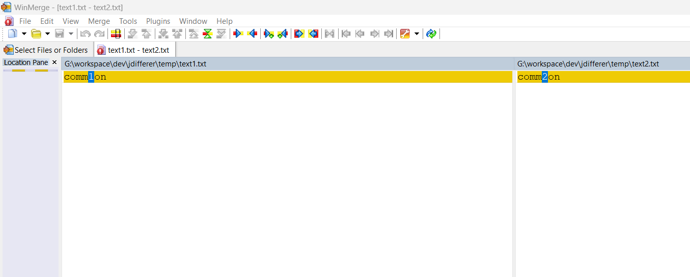
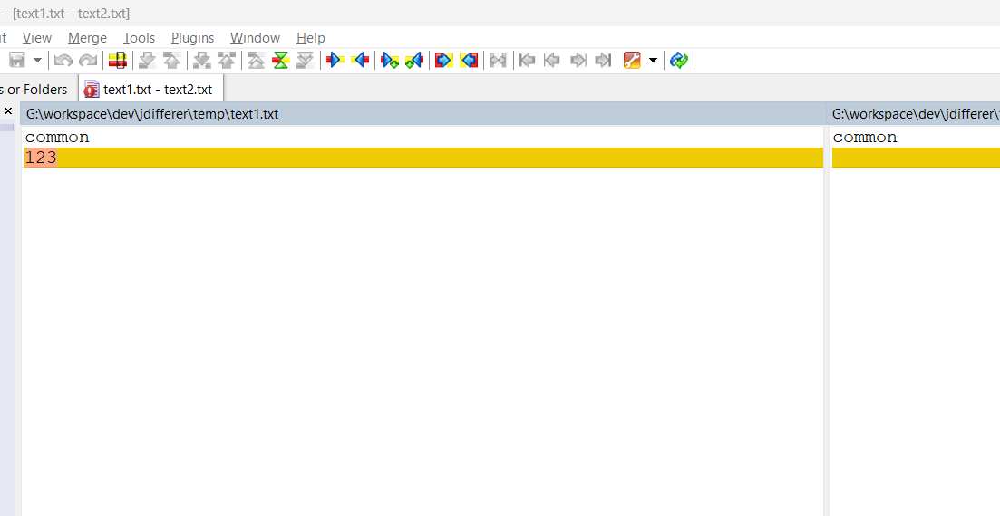
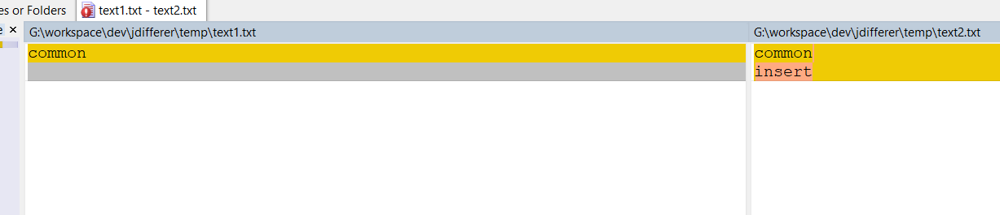

diff jar

读取A文件夹和B文件夹，创建这两个文件夹的树。

用一个数组`D`来存储两颗树的差异，元素是TreeDifference，后者存储了两个node

## TODO

- [x] filetree
- [x] main gui
- [ ] dialog for choosing directory
- [x] code highlight
- [ ] diff
- [ ] line wrap
- [ ] auto expand
- [ ] error dialog
- [ ] ctrl f
## diff
## diff file tree:

return commons file list:
把path拼接分别读文件的逻辑在services层里
遍历获得path，分别遍历dirA，dirB生成DiffFileNodeInfo数组，去掉一样的文件，然后丢到diffNode里。点击事件在MainFrame里

## diff file

change

yellow

delete

red

INSERT

green

## filetree

- filetree
  -- update
  -- add
  -- delete
