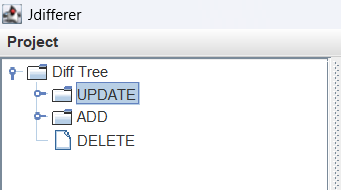

# Jdifferer

[English](readme.md) | [中文](readme-zh.md)

Jdifferer is a GUI application used to diff the code of two jars. It provides a convenient approach to compare the differences of jars file for developers and security researchers.

Jdifferer can decompile the jar files automatically and provides a friendly GUI view to show the differences between the files in the aspect of source code.

[jd-core](https://github.com/java-decompiler/jd-core) provides the decompiling APIs.

   

## Usage

Choose Project -> open on the top-left to choose the two jar files to diff.

The sidebar on the left side provides three nodes, representing the updated, added and deleted files of the compared jar files, respectively.

When you choose one update node, red contents are deleted contents, green contents are added contents and yellow contents are updated contents. (image below is yet a demo)

## TODO

- [x] filetree
- [x] main gui
- [x] dialog for choosing directory
- [x] code highlight
- [x] diff
- [x] line wrap
- [ ] auto expand
- [x] error dialog
- [ ] ctrl f

